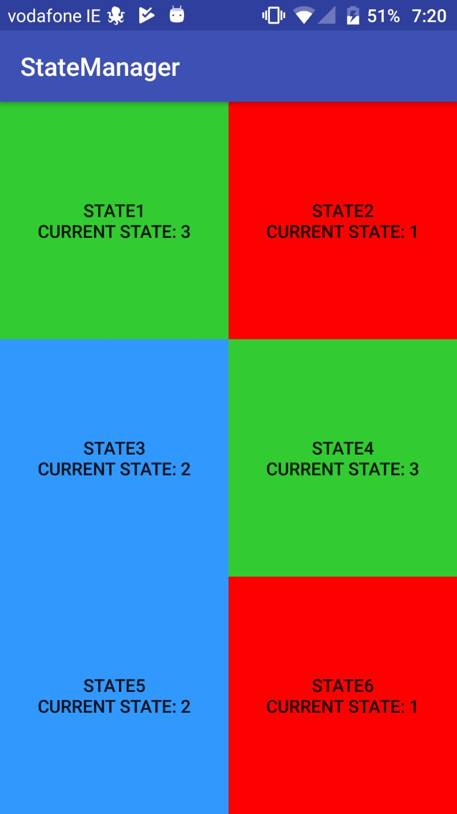
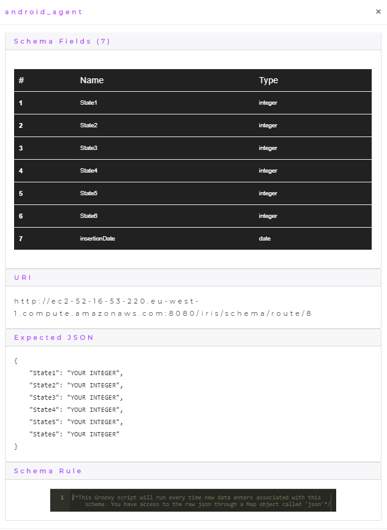
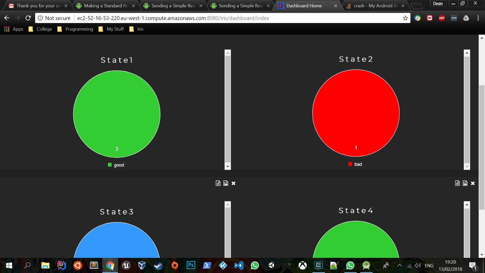

    

        
    

# Iris Android Agent

This repository contains the Android agent for my final year project [Iris](https://github.com/DeanGaffney/iris). The Android agent used to demonstrate Iris' ability to handle state based data. The agent is an application with a grid based UI. Each tile on the UI has a colour coded state that matches the following green => good, blue => neutral, red => bad. Each colour also has a numeric value mapped to it which matches the following structure green => 3, blue => 2, red => 1. When a user holds down on a tile the tile changes colour which represents the next state. When the user taps the screen the state of all the tiles are sent up to Iris where it is visualised on a state based dashboard with custom labels and colours for each state based chart.

## UI
The following is an image of the android application UI.

## Agent Schema
The following is the schema that was created in Iris for the agent.

## Agent Dashboard
The following image shows the dashboard for the agent inside Iris where it is keeping track of states being sent from the android application.

## Agent Transformation Rule
This agent has no transformation rule, please see the [Node.js Agent](https://github.com/DeanGaffney/iris-node) for an example of a transformation rule.

## Other Iris agents
* [Selenium](https://github.com/DeanGaffney/iris-selenium)
* [Node.js](https://github.com/DeanGaffney/iris-node)
* [MySQL](https://github.com/DeanGaffney/iris-mysql)
* [Crypto Currency Rates](https://github.com/DeanGaffney/iris-crypto-rates)

## Built With

- Android

## Authors

* **Dean Gaffney**

See also the list of [contributors](https://github.com/DeanGaffney/iris-android/graphs/contributors) who participated in this project.